# Company Layoffs
 
## **Project Background**
In recent years, many companies from various industries have faced finanical and economical challenges that have led to significant layoffs. 

It is important to gain a deeper understanding of the economic health of the various industries. This project performs an exploratory data anaylsis, analyzing layoff trends in order to answer business questions that will gain insight on how different industries and companies respond to crises.

### **Insights and recommendations are provided based on the following business questions:**
- What is the maximum number of employees laid off and the highest percentage of layoffs across all companies?
- Which companies laid off their entire workforce, and how many employees were affected?
- What are the total layoffs for each company across all years, and which companies have laid off the most employees?
- What is the time frame during which the layoffs occurred (earliest and latest dates)?
- Which industries have experienced the highest total number of layoffs?
- Which countries have had the most layoffs, and how do the total layoffs compare across different countries?
- How do layoffs compare across different years?
- Which company stages experienced the most layoffs?
- What is the average percentage of layoffs in each industry?
- What are the monthly rolling totals for layoffs?
- What are the total layoffs for each company, and how have layoffs evolved annually for each company?
- Who were the top 5 companies with the most layoffs each year?

## **Data Structure**
The source of data was obtained from [Github](https://github.com/AlexTheAnalyst/MySQL-YouTube-Series/blob/main/layoffs.csv). Superstore’s data consists of 2362 rows from March 2020 to March 2023, containing one table of all layoffs during that period.

The database structure can be seen below:  
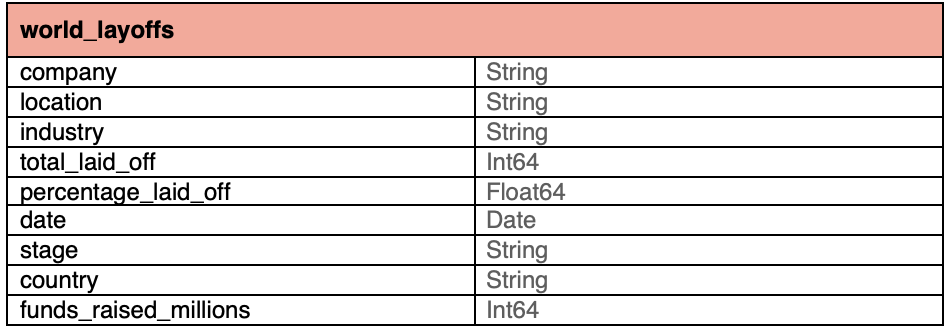

## **Data Cleaning**
Prior to the exploratory data analysis, data cleaning was performed to remove duplicates, standardize the data, handle missing values, and remove unnecessary columns. 

SQL queries were used to clean the data and are included below. The full SQL data cleaning file can be found [here](./Data%20Cleaning.sql).

### **1. Remove Duplicates**
~~~ WITH duplicate_cte AS
(
SELECT *,
ROW_NUMBER() OVER(
PARTITION BY 
	company, 
    location, 
    industry, 
    total_laid_off, 
    percentage_laid_off, 
    `date`, 
    stage,
	country, 
    funds_raised_millions) as row_num
FROM layoffs_staging
)
DELETE 
FROM duplicate_cte
WHERE row_num > 1;
~~~
With this method, I was able to identify and eliminate any duplicate records to ensure that each entry is unique.

### **2. Standardize Data**
~~~
UPDATE layoffs_staging2
SET company = TRIM(company);
~~~

In this step, trailing white spaces were removed.

~~~
UPDATE layoffs_staging2
SET industry = 'Crypto'
WHERE industry LIKE 'Crypto%';

UPDATE layoffs_staging2
SET country = 'United States'
WHERE country LIKE 'United States%';
~~~
In this step, Similar entries were altered to have the same name. 

~~~
UPDATE layoffs_staging2
SET `date` = NULL
WHERE `date` = 'NULL';

UPDATE layoffs_staging2
SET `date` = STR_TO_DATE(`date`, '%m/%d/%Y');

ALTER TABLE layoffs_staging2
MODIFY COLUMN `date` DATE;
~~~
In this step, all dates were converted from strings to dates.

### **3. Handle Null and Blank Values**
~~~
UPDATE layoffs_staging2
SET percentage_laid_off = NULL
WHERE percentage_laid_off = 'NULL';

UPDATE layoffs_staging2
SET industry = NULL
WHERE industry = 'NULL';
~~~
In this step, any string nulls were converted to NULL type for future steps.

~~~
UPDATE layoffs_staging2 t1
JOIN layoffs_staging2 t2
	ON t1.company = t2.company
	AND t1.location = t2.location
SET t1.industry = t2.industry
WHERE t1.industry IS NULL
AND t2.industry IS NOT NULL;
~~~
In this step, blank values are updated to match their corresponding values.

### **4. Remove Unnecessary Columns and Rows**
~~~
DELETE 
FROM layoffs_staging2
WHERE total_laid_off IS NULL
AND percentage_laid_off IS NULL;

ALTER TABLE layoffs_staging2
DROP COLUMN row_num;
~~~
In this step, any rows with null values and the row_num column were deleted.

## **Executive Summary**
### **Overview of Findings**
Since the pandemic, significant layoffs have affected many industries and companies. The following sections will explore the contributing factors to these descisions and help businesses better understand workforce trends during economic crises to develop strategies to mitigate future layoffs.

SQL queries were used to answer the business questions and are included throughout the report. The full SQL query file can be found [here](./Exploratory%20Data%20Analysis.sql).

### **What is the maximum number of employees laid off and the highest percentage of layoffs across all companies?**
~~~
SELECT 
	MAX(total_laid_off) AS `Max Employees Laid Off`, 
    MAX(percentage_laid_off) AS `Max Percentage Laid Off`
FROM layoffs_staging2;
~~~
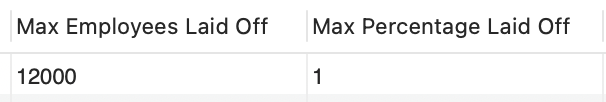

**Insights**  
The maximum number of employees laid off was 12,000 employees and the highest percentage was 100%.

### **Which companies laid off their entire workforce, and how many employees were affected?**
~~~
SELECT * 
FROM layoffs_staging2
WHERE percentage_laid_off = 1
ORDER BY total_laid_off DESC;
~~~
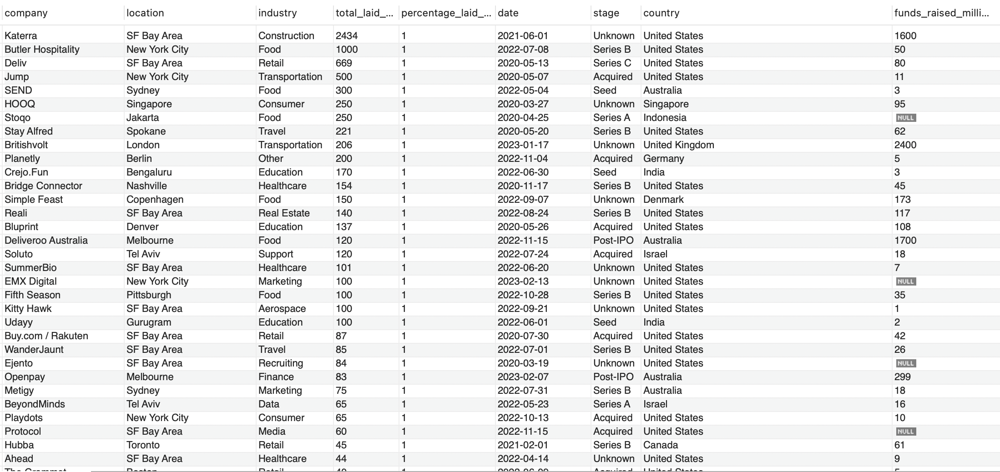

**Insights**  
There were many companies that laid off their entire workforce. The top 5 companies include:
1. **Katerra** (laid off **2434** employees)
2. **Butler Hospitality** (laid off **1000** employees)
3. **Deliv** (laid off **669** employees)
4. **Jump** (laid off **500** employees)
5. **SEND** (laid off **300** employees)

### **What are the total layoffs for each company across all years, and which companies have laid off the most employees?**
~~~
SELECT 
    company, 
    SUM(total_laid_off) AS `Total Laid Off`
FROM layoffs_staging2
GROUP BY company
ORDER BY 2 DESC;
~~~
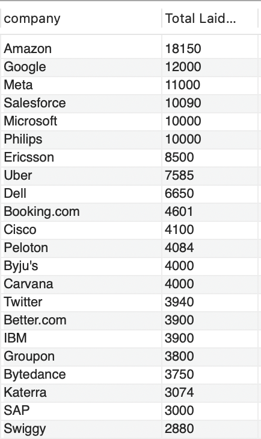

**Insights**  
The top 5 companies that laid off the most employees across all years were: 
1. **Amazon** (laid off **18150** employees)
2. **Google** (laid off **12000** employees)
3. **Meta** (laid off **11000** employees)
4. **Salesforce** (laid off **10090** employees)
5. **Microsoft** (laid off **10000** employees)

### **What is the time frame during which the layoffs occurred?**
~~~
SELECT 
	MIN(`date`) AS `Start`, 
	MAX(`date`) AS `End`
FROM layoffs_staging2;
~~~
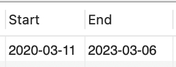

**Insights**  
The time frame of the layoffs is from **March 11, 2020** to **March 6, 2023**

### **Which industries have experienced the highest total number of layoffs?**
~~~
SELECT 
	industry, 
    SUM(total_laid_off) AS `Total Laid Off`
FROM layoffs_staging2
GROUP BY industry
ORDER BY 2 DESC;
~~~
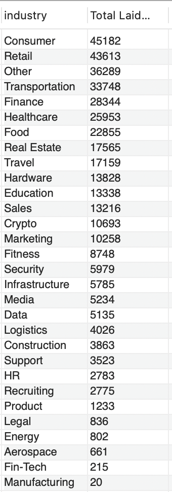

**Insights**  
The top 5 industires that laid off the most employees were: 
1. **Consumer** (laid off **45182** employees)
2. **Retail** (laid off **43613** employees)
3. **Other** (laid off **36289** employees)
4. **Transportation** (laid off **33748** employees)
5. **Finance** (laid off **28344** employees)

### **Which countries have had the most layoffs, and how do the total layoffs compare across different countries?**
~~~
SELECT 
	country, 
    SUM(total_laid_off) AS `Total Laid Off`
FROM layoffs_staging2
GROUP BY country
ORDER BY 2 DESC;
~~~
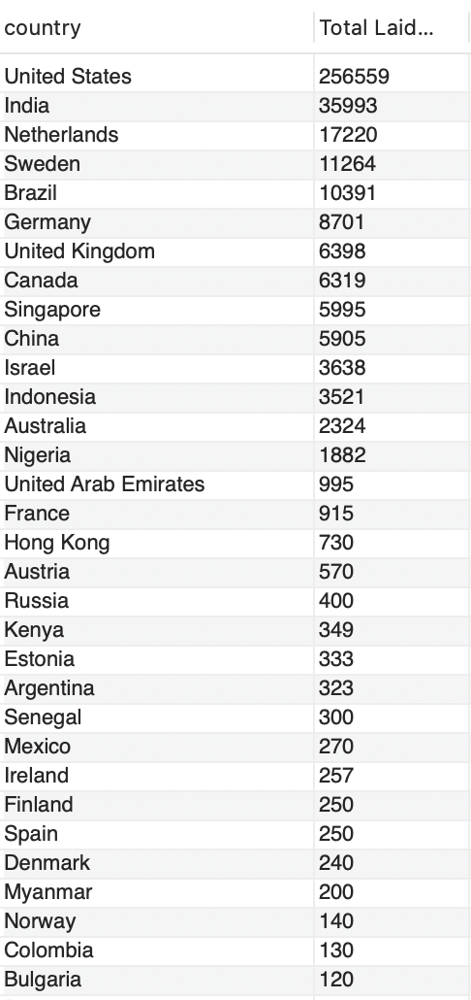

**Insights**  
The top 5 countries that laid off the most employees were: 
1. **United States** (laid off **256559** employees)
2. **India** (laid off **35993** employees)
3. **Netherlands** (laid off **17220** employees)
4. **Sweden** (laid off **11264** employees)
5. **Brazil** (laid off **10391** employees)

### **How do layoffs compare across different years?**
~~~
SELECT 
	YEAR(`date`) AS `Year`, 
    SUM(total_laid_off) AS `Total Laid Off`
FROM layoffs_staging2
GROUP BY YEAR(`date`)
ORDER BY 1 DESC;
~~~
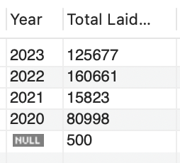

**Insights**  
**2022 had the highest number of layoffs**, with **160,661** layoffs reported, suggesting significant economic challenges in this year. **2023 saw a decline in layoffs**, compared to 2022, dropping to **125,677** layoffs. **2021 had the fewest layoffs**, with only **15,823** layoffs. **2020 had a significant amount of layoffs**, with **80,998** layoffs, which was likely due to the pandemic. 

### **Which company stages experienced the most layoffs?**
~~~
SELECT 
	stage, 
    SUM(total_laid_off) AS `Total Laid Off`
FROM layoffs_staging2
GROUP BY stage
ORDER BY 2 DESC;
~~~
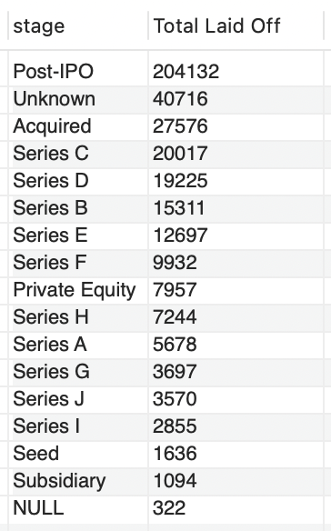

**Insights**  
The top 5 company stages that laid off the most employees were: 
1. **POST-IPO** (laid off **204132** employees)
2. **Unknown** (laid off **40716** employees)
3. **Acquired** (laid off **27576** employees)
4. **Series C** (laid off **20017** employees)
5. **Series D** (laid off **19225** employees)

### **What is the average percentage of layoffs in each industry?**
~~~
SELECT 
	industry, 
    ROUND(AVG(percentage_laid_off), 2) AS `Percentage Laid Off`
FROM layoffs_staging2
GROUP BY industry
ORDER BY 2 DESC;
~~~
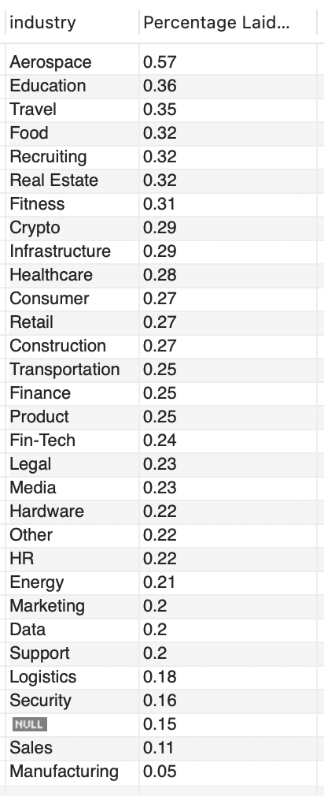

**Insights**  
The top 5 industries that laid off the most employees were: 
1. **Aerospace** (laid off **57%** of employees)
2. **Education** (laid off **36%** of employees)
3. **Travel** (laid off **35%** of employees)
4. **Food** (laid off **32%** of employees)
4. **Recruiting** (laid off **32%** of employees)
4. **Real Estate** (laid off **32%** of employees)

### **What are the monthly rolling totals for layoffs?**
~~~
WITH Rolling_total AS
(
SELECT SUBSTRING(`date`, 1, 7) AS `MONTH`, SUM(total_laid_off) AS total_off
FROM layoffs_staging2
WHERE SUBSTRING(`date`, 1, 7) IS NOT NULL
GROUP BY `MONTH`
ORDER BY 1 ASC
)
SELECT `MONTH`, total_off,
SUM(total_off) OVER(ORDER BY `MONTH`) AS rolling_total
FROM Rolling_Total;
~~~
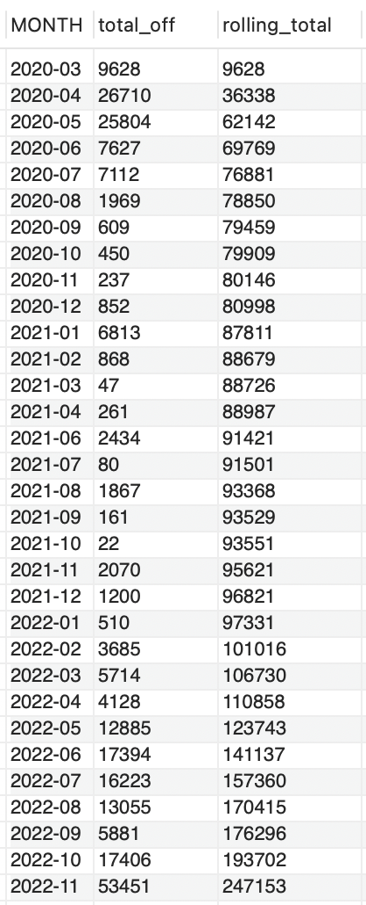

**Insights**  
In **2020**, layoffs peaked in **April and May 2020, with 26,710 and 25,804 layoffs**, respectively. 

In **2021**, there was **relatively low layoffs** with the rolling total only reaching **96,821** by the end of the year.  

In **2022**, there was a signifcant spike in layoffs with **November** showing the highest monthly total of **53,451**. By the end of 2022, the rolling total was **257,482** which was a significant year-over-year increase. 

In **2023**, it started off with a massive layoff spike in **January with 84,714 layoffs**, which slowed down by March with the rolling total ending with **383,159** layoffs. 

### **What are the total layoffs for each company, and how have layoffs evolved annually for each company?**
~~~
SELECT 
	company, 
	YEAR(`date`) AS `YEAR`, 
    SUM(total_laid_off) AS `Total Laid Off`
FROM layoffs_staging2
WHERE YEAR(`date`) IS NOT NULL
GROUP BY company, `YEAR`
ORDER BY 3 DESC;
~~~
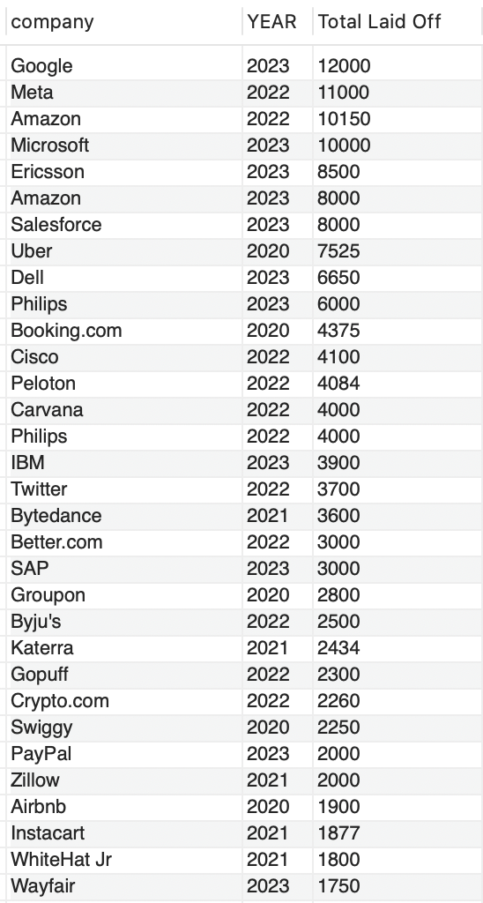

**Insights**  
**2023** witnessed major layoffs across tech giants like **Google, Microsoft, Salesforce, and Dell**, driven by economic challenges and over-expansion during the pandemic.  

**2022** was marked by sizable layoffs from companies like **Meta, Amazon, and Twitter**, reflecting market shifts and cost-cutting post-pandemic. 

The **2020** layoffs were concentrated in sectors directly impacted by the pandemic, such as **Uber and Booking.com**.

### **Who were the top 5 companies with the most layoffs each year?**
~~~
WITH Company_Year(company, years, total_laid_off) AS
(
SELECT company, YEAR(`date`) AS `YEAR`, SUM(total_laid_off) AS total_off
FROM layoffs_staging2
WHERE YEAR(`date`) IS NOT NULL
GROUP BY company, `YEAR`
), Company_Year_Rank AS
(
SELECT company, years, total_laid_off, 
DENSE_RANK() OVER(PARTITION BY years ORDER BY total_laid_off DESC) AS ranking
FROM Company_Year
WHERE years IS NOT NULL
)
SELECT *
FROM Company_Year_Rank
WHERE Ranking <= 5
;
~~~
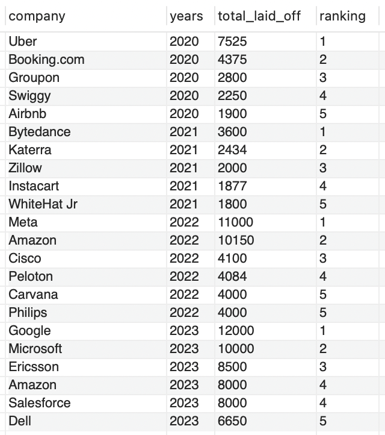

**Insights**  
In **2020**, the pandemic hit the travel and service industries hard. Uber led with 7,525 layoffs, followed by Booking.com (4,375) and Groupon (2,800). Companies like Swiggy and Airbnb also cut significant numbers.

In **2021**, tech companies began downsizing, with Bytedance (3,600) leading, followed by Katerra (2,434) and Zillow (2,000). The list also included Instacart and WhiteHat Jr.

In **2022**, tech giants like Meta (11,000) and Amazon (10,150) dominated layoffs, reflecting large-scale restructuring. Cisco, Peloton, and Carvana also had significant cuts.

In **2023**, Google topped the list with 12,000 layoffs, followed by Microsoft (10,000) and Ericsson (8,500). Amazon and Salesforce both had 8,000 layoffs, with Dell at 6,650.

## **Recommendations**
- Due to the large amount of layoffs in 2022 and 2003, tech Giants, such as Google, Microsoft, Amazon, and Meta, could focus on **agile workforce management** to help retain talent and reduce finanical burdens.
- As industries such as retail and finance are more sensitive to economic downturns and market shifts, they could focus on **cross-training employees** or **leveraging contract work** to prevent massive layoffs. 
- As startups in Series C and D laid over 19,000 employees, they could focus **funding on buldiing long-term viability** as a caution to overexpansion. 